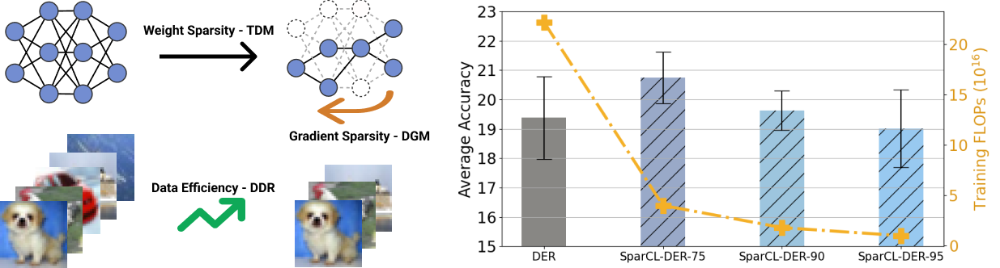

# Official Implementation of SparCL @ NeurIPS 22

This codebase contains the implementation of **[SparCL: Sparse Continual Learning on the Edge](https://arxiv.org/pdf/2209.09476.pdf) (NeurIPS2022)**.

## Introduction
In this work, we propose a novel framework called Sparse Continual Learning
(SparCL), which is the first study that leverages sparsity to enable cost-effective
continual learning on edge devices. SparCL achieves both training acceleration
and accuracy preservation through the synergy of three aspects: weight sparsity,
data efficiency, and gradient sparsity. SparCL outperforms competitive baselines 
obtained from adapting SOTA sparse training methods to the CL setting in
both efficiency and accuracy. We also evaluate the effectiveness of SparCL on a
real mobile phone, further indicating the practical potential of our method. 
<p align="center">

</p>


## Enviroment setup
The code is developed using PyTorch>=1.2.0.            


## Instructions
We provide a sample bash script to run our method at 0.75 sparsity ratio.


To run SparCL:

```
bash ./scripts/resnet18/run_mag_prune_irr_sp_EM_0.75_gradient0.80.sh
```

 Note: In this version, we made some slight changes from the paper. For example, we observe that setting $\alpha=\beta$ in (1) and (3) results in similar performance. To simplify the logic, we merge the two importance scores w.r.t. current data and buffered data as a single term.

## Cite
```
@inproceedings{wangsparcl,
  title={SparCL: Sparse Continual Learning on the Edge},
  author={Wang, Zifeng and Zhan, Zheng and Gong, Yifan and Yuan, Geng and Niu, Wei and Jian, Tong and Ren, Bin and Ioannidis, Stratis and Wang, Yanzhi and Dy, Jennifer},
  booktitle={Advances in Neural Information Processing Systems}
}
```
